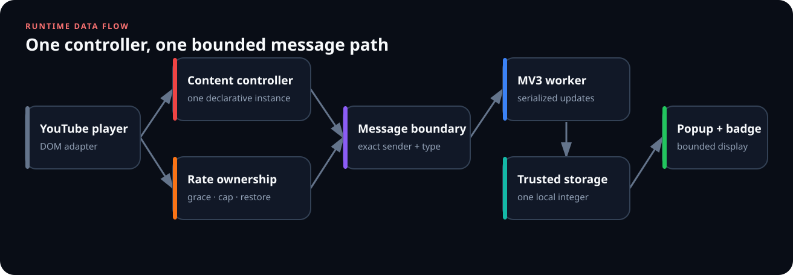
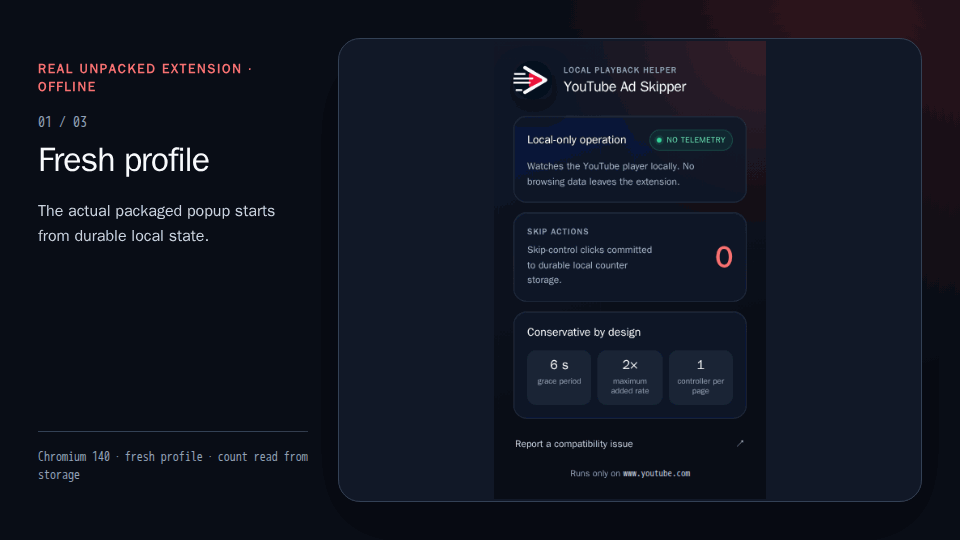
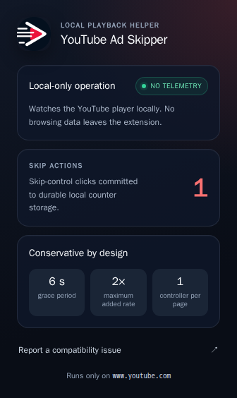
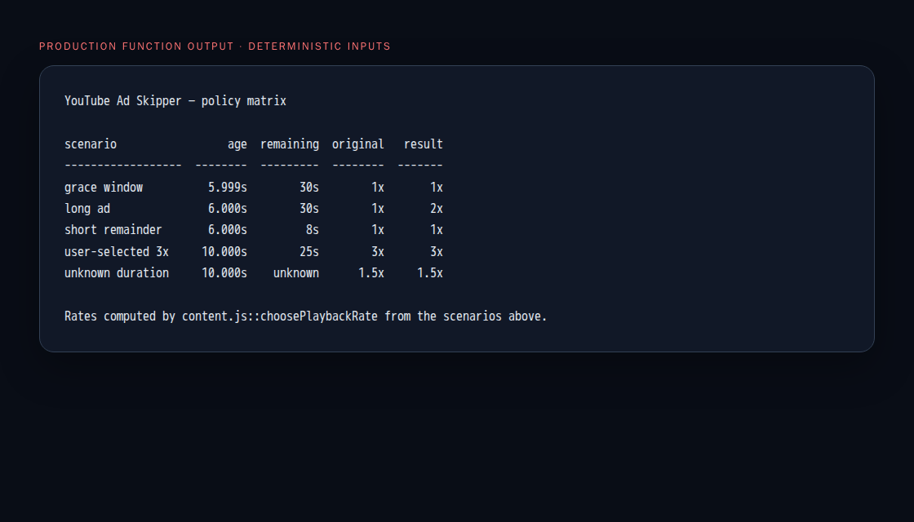
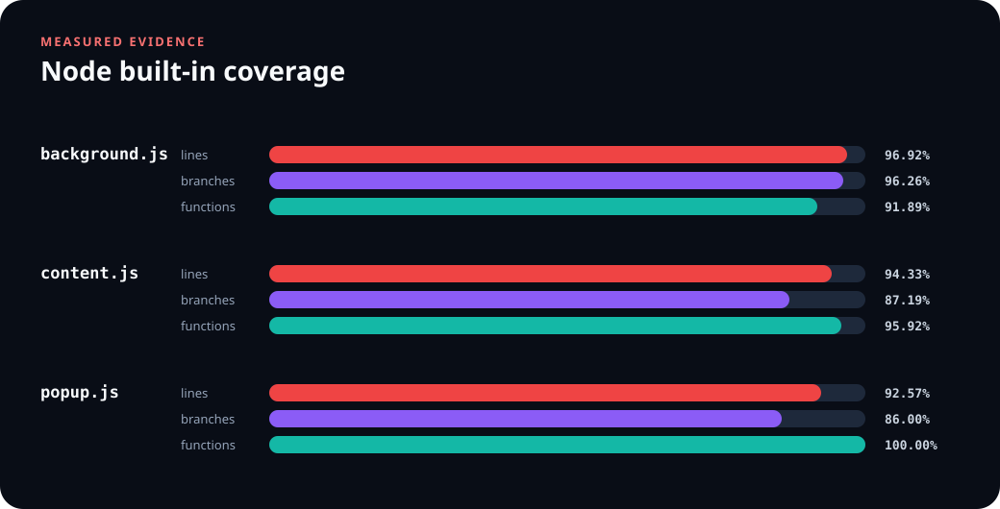
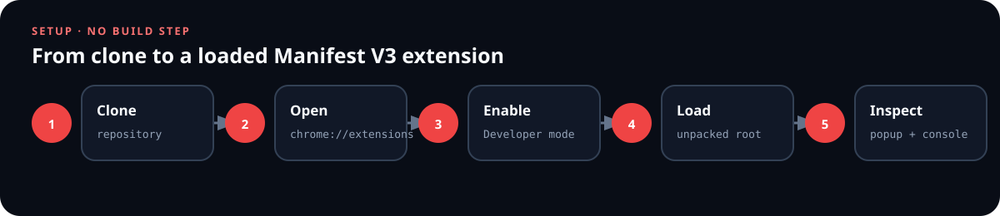

# YouTube Ad Skipper

<p align="center">
  
</p>

A small Manifest V3 extension that uses YouTube's rendered player controls: it
requests an available skip action and conservatively accelerates only longer
ads. It does not block ad requests, hide network traffic, or promise an
ad-free session.

## Why version 2 exists

The original extension started the same polling script twice and left videos
at `9.5×` after an ad. Version 2 replaces that behavior with one owned state
machine:

- one declarative content script, with no programmatic reinjection;
- a six-second grace period before any acceleration;
- a `2×` extension-added ceiling, disabled for the last eight seconds;
- skip-first ordering and playback-rate restoration;
- retrying action reports with a bounded deduplication window across worker
  wake-ups;
- serialized counter updates from simultaneous tabs in each active worker;
- exact sender checks and a single `storage` permission.

The counter is deliberately named **skip actions**. A live content context
retries one random action ID until the worker acknowledges its local storage
commit. The worker keeps the latest 256 IDs in the same versioned value as the
count, suppresses retained replays, and reapplies the badge before acknowledging
a duplicate. This repairs worker interruption windows around storage, badge,
and response delivery without recording a URL, tab ID, video ID, or timestamp.

This is bounded idempotency, not a transaction with the page. Destroying the
content context after a successful DOM click but before its first report can
still leave that click unrecorded; a retry delayed beyond 256 newer actions is
outside the deduplication window. If 128 reports remain pending, or secure ID
generation is unavailable, skipping stays active but newer clicks are omitted
from the best-effort tally. The tally is not a count of unique ads and is not
proof that YouTube completed a skip.

## Runtime workflow



The state machine treats YouTube's DOM as an unstable adapter. Source changes,
time rollbacks, page lifecycle events, user rate changes, and temporary media
setter failures have explicit recovery paths.

## Reproducible visual evidence

### Offline extension workflow

<p align="center">
  
</p>

The GIF is composed from three screenshots captured in one real unpacked
Chromium session: the fresh popup at `0`, the handled offline fixture, and the
same popup at `1`. Captions are deterministic annotations; the popup and
fixture pixels come from the running extension. Every other HTTP(S) request
was aborted. This demonstrates the extension boundary only—it is not live
YouTube-ad acceptance.

### Real unpacked-extension popup

<p align="center">
  
</p>

This is the actual packaged popup in Chromium 140, not a UI mockup. A fresh
profile loaded the unpacked extension; one clearly named offline DOM-contract
fixture exercised the real content script and MV3 service worker, producing the
visible count of `1`. The capture aborted every other HTTP(S) request. It is
evidence of the extension boundary, not a claim about a live YouTube ad.

### Production policy output



The underlying [plain-text transcript](docs/evidence/policy-matrix.txt) is
computed directly by `content.js::choosePlaybackRate`. The scenarios expose the
grace boundary, long-ad ceiling, short remainder, user-selected rate, and
unknown-duration fallback.

### Measured test coverage



The chart is generated from Node's built-in coverage report. Exact values live
in [coverage-summary.json](docs/evidence/coverage-summary.json); every input and
output hash, browser version, fixture contract, and network rule is recorded in
[visual-manifest.json](docs/evidence/visual-manifest.json).

## Install the unpacked extension



1. Clone this repository.
2. Open `chrome://extensions`.
3. Enable **Developer mode**.
4. Select **Load unpacked**.
5. Choose the repository root (the directory containing `manifest.json`).

Chrome 102 or newer is required because local storage is restricted to trusted
extension contexts with `storage.local.setAccessLevel`.

## Verify the implementation

The extension runtime and core tests have no third-party dependencies. Node.js
18 or newer is enough; `npm ci` installs three pinned development tools used
for PNG, GIF, and Chromium evidence:

```bash
npm ci --ignore-scripts
npm run check
npm run coverage
```

The tests exercise rate ownership, short-ad boundaries, ad-pod transitions,
retryable restoration, one-click-per-episode behavior, exact action
acknowledgements, replay suppression, storage-to-badge recovery, concurrent
counter updates, sender validation, permission minimization, and every local
manifest asset.

The checked-in visuals are regenerated with a digest-pinned official Playwright
container:

```bash
npm run visuals:capture
npm run visuals:verify
```

The wrapper first performs a fresh `npm ci --ignore-scripts` in disposable
scratch space, where npm verifies the pinned package integrities. The capture
container mounts an isolated scratch tree containing the hash-bound source
inputs plus freshly lockfile-installed development dependencies—not the working
repository—with private IPC, a loopback-only network namespace, and a fresh
browser profile. Only verified, allowlisted outputs are promoted back; all
scratch data is removed.

The manifest and bound scripts form a reproducibility and drift contract. They
record the exact image digest, tool versions, observed network namespace,
fixture fulfillment, inputs, and outputs. This is useful provenance evidence,
not cryptographic attestation of the machine or operator.

GIF verification does not stop at the file hash or animation envelope. The
independent decoder bounds input and decompressed pixels, requires complete LZW
streams and exact frame controls, then matches the decoded RGB SHA-256 of every
frame. Negative tests cover malformed controls, missing end codes, trailing
controls, and decompression-boundary abuse.

## Privacy and permissions

| Surface | Behavior |
| --- | --- |
| Site access | Static content script only on `https://www.youtube.com/*` |
| Named permission | `storage` |
| Stored value | One local object: count plus at most 256 random action IDs |
| Remote code/assets | None |
| Analytics or telemetry | None |

Version 2 migrates the legacy integer by writing the versioned state first and
removing the old key second. If removal is interrupted, both values can briefly
coexist; the versioned state remains authoritative and the next successful
worker operation retries cleanup.

The popup has no donation widget, personal contact link, or remotely hosted
image. Compatibility reports belong in
[GitHub Issues](https://github.com/omar07ibrahim/YouTube-Ad-Skipper/issues).

## Compatibility status

YouTube's CSS classes are not a public API and can change without notice. The
pure controller and service-worker behavior are covered by deterministic tests;
the offline unpacked-extension boundary is captured above. A live-site
Chromium acceptance run is still required before version 2 is tagged or issue
[#3](https://github.com/omar07ibrahim/YouTube-Ad-Skipper/issues/3) is closed.
In particular, a real short-ad run must confirm that the grace policy behaves
as intended.

## License

[MIT](LICENSE) © 2026 Omar Ibrahim
