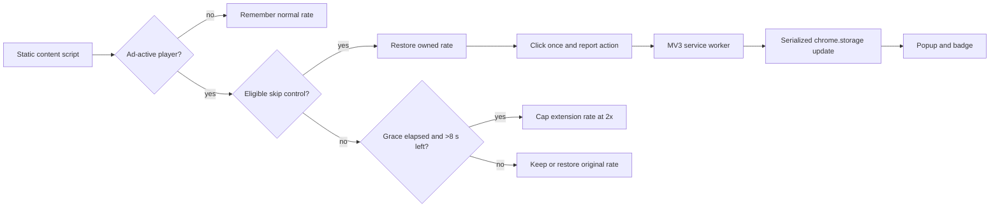

# YouTube Ad Skipper

<p align="center">
  
</p>

A small Manifest V3 extension that uses YouTube's rendered player controls: it
requests an available skip action and conservatively accelerates only longer
ads. It does not block ad requests, hide network traffic, or promise an
ad-free session.

## Why version 2 exists

The original extension started the same polling script twice and left videos
at `9.5×` after an ad. Version 2 replaces that behavior with one owned state
machine:

- one declarative content script, with no programmatic reinjection;
- a six-second grace period before any acceleration;
- a `2×` extension-added ceiling, disabled for the last eight seconds;
- skip-first ordering and playback-rate restoration;
- serialized counter updates across simultaneous tabs;
- exact sender checks and a single `storage` permission.

The counter is deliberately named **skip actions**. It records successful calls
to an available skip control; it is not proof that YouTube completed a skip.

## Runtime workflow



The state machine treats YouTube's DOM as an unstable adapter. Source changes,
time rollbacks, page lifecycle events, user rate changes, and temporary media
setter failures have explicit recovery paths.

## Install the unpacked extension

1. Clone this repository.
2. Open `chrome://extensions`.
3. Enable **Developer mode**.
4. Select **Load unpacked**.
5. Choose the repository root (the directory containing `manifest.json`).

Chrome 102 or newer is required because local storage is restricted to trusted
extension contexts with `storage.local.setAccessLevel`.

## Verify the implementation

No package download is needed for the core checks. Node.js 18 or newer is
enough:

```bash
npm ci
npm run check
npm run coverage
```

The tests exercise rate ownership, short-ad boundaries, ad-pod transitions,
retryable restoration, one-click-per-episode behavior, concurrent counter
updates, sender validation, permission minimization, and every local manifest
asset.

## Privacy and permissions

| Surface | Behavior |
| --- | --- |
| Site access | Static content script only on `https://www.youtube.com/*` |
| Named permission | `storage` |
| Stored value | One local integer: the skip-action count |
| Remote code/assets | None |
| Analytics or telemetry | None |

The popup has no donation widget, personal contact link, or remotely hosted
image. Compatibility reports belong in
[GitHub Issues](https://github.com/omar07ibrahim/YouTube-Ad-Skipper/issues).

## Compatibility status

YouTube's CSS classes are not a public API and can change without notice. The
pure controller and service-worker behavior are covered by deterministic tests;
an unpacked Chromium acceptance run is still required before version 2 is
tagged or issue
[#3](https://github.com/omar07ibrahim/YouTube-Ad-Skipper/issues/3) is closed.
In particular, a real short-ad run must confirm that the grace policy behaves
as intended.

## License

[MIT](LICENSE) © 2026 Omar Ibrahim
